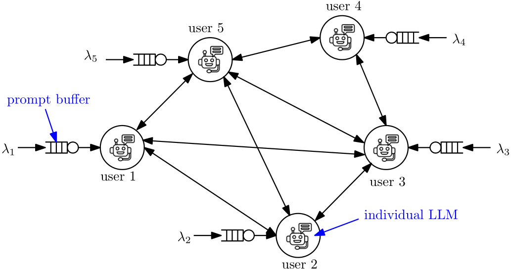
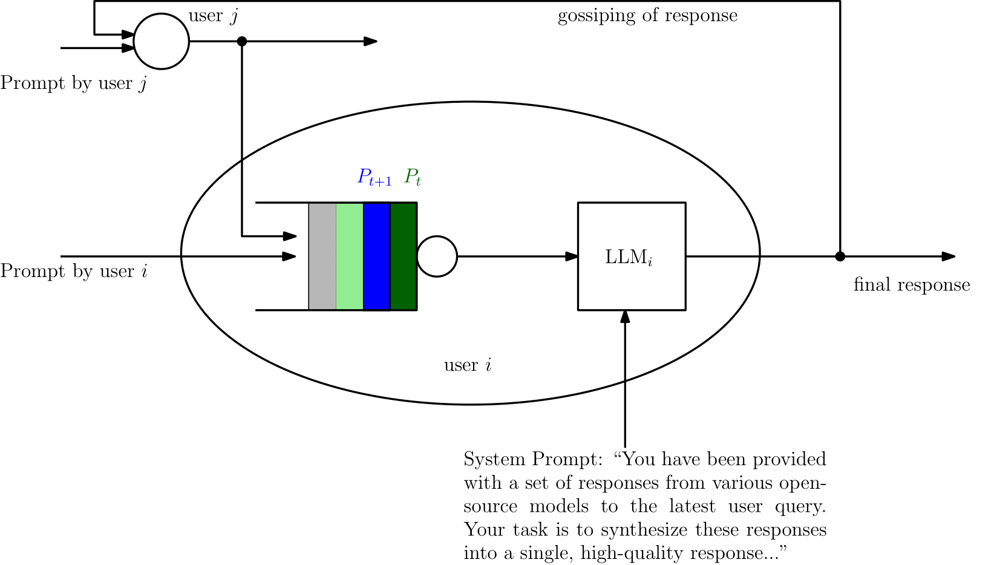
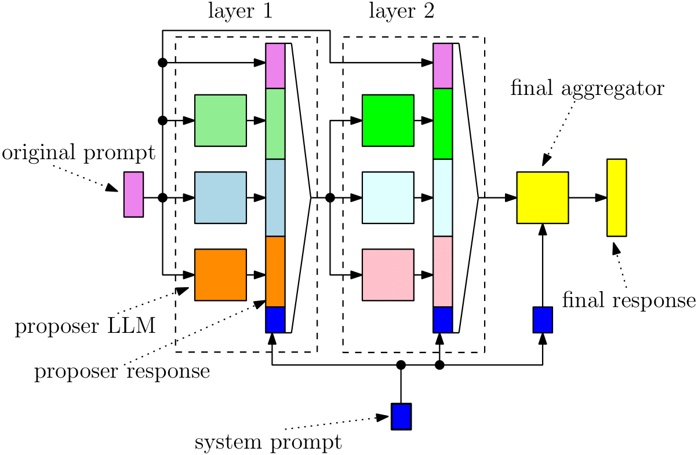

# Distributed Mixture-of-Agents

Distributed Mixture-of-Agents (MoA) is an MoA architecture in a distributed setting, where LLMs operate on individual edge devices, each uniquely associated with a user and equipped with its own distributed computing power. These devices exchange information using decentralized gossip algorithms, allowing different device nodes to talk without the supervision of a centralized server. The MoA setting enhances the overall performance of large language models (LLMs), enabling multiple individual LLMs to work together for collaborative inference. This collaborative approach results in improved responses to user prompts compared to relying on a single LLM. 

🔗 Paper link: [Distributed Mixture-of-Agents for Edge Inference with Large Language Models](https://arxiv.org/abs/2412.21200)

<p align="center">
  
</p>

In the considered setup, different users have their own LLM models to address user prompts. Additionally, the devices gossip either their own user-specific prompts or augmented prompts to generate more refined answers to certain queries. User prompts are temporarily stored in the device queues when their corresponding LLMs are busy. 

<p align="center">
  
</p>

Given the memory limitations of edge devices, to ensure that the average queue sizes in the system remain bounded, the pormpt arrival rate at the users is bounded by some theoritical limit. The limit also depends on the number of layeys in the MoA, and the number of proposer LLMs in each layer. The MoA setting is shown below:

<p align="center">
  
</p>


## Citation
If you find our work useful, consider citing it as:
```bibtex
@article{
    mitra2024distributed,
    title={Distributed Mixture-of-Agents for Edge Inference with Large Language Models},
    author={Purbesh Mitra and Priyanka Kaswan and Sennur Ulukus},
    journal={arXiv preprint arXiv:2412.21200},
    year={2024}
}
```
